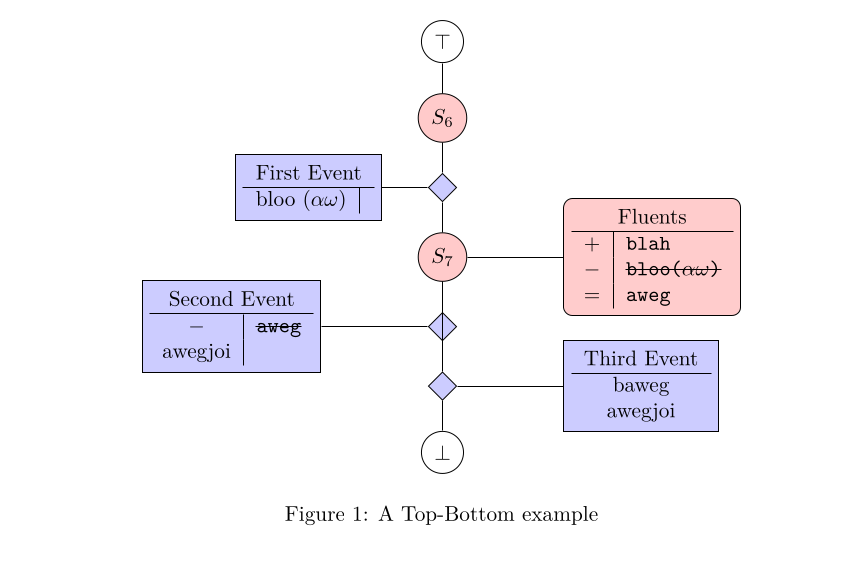

<!-- readme.md -*- mode: markdown-mode -*- -->

# Tikz-Eventchain

A LuaTex based tikz library to create eventchain diagrams.

Provides the environment `eventchain` and the sub-environments `event` and `fluents`,
with commands `\state`, `\jumpto`, `\addfluent`, `\subfluent`, and `\keepfluent`.

An Example: 
```tex
\usepackage{eventchain}

\begin{figure}
  \begin{center}
    \begin{eventchain}[start=5, dist=0.5cm]
      \state
      \begin{event}[name=First Event, dist=1cm, cols=2, fmt={c | l}]
        bloo ($ \alpha \omega $) \\
      \end{event}
      \begin{fluents}[name=Fluents, dist=2cm, cols=2, fmt={c | l}]
        \addfluent{blah} \\
        \subfluent{bloo($ \alpha \omega $)} \\
        \keepfluent{aweg} \\
      \end{fluents}
      \begin{event}[name=Second Event, cols=2, fmt={c | l}]
        \subfluent{aweg} \\
        awegjoi \\
      \end{event}
      \begin{event}[name=Third Event]
        baweg \\
        awegjoi \\
      \end{event}
    \end{eventchain}
  \end{center}
  \caption{A Top-Bottom example}
\end{figure}
```

Resulting in:


